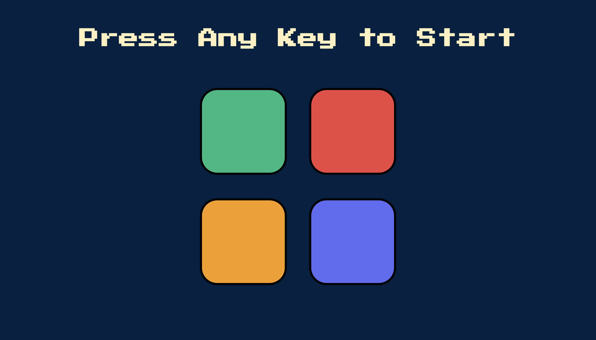

# Simon Game

A practice project of JavaScript which is one of outcomes from web developer bootcamp course.
User need to memorize and follow the random generated pattern. If pattern is wrong, game is over.

## Screenshot

